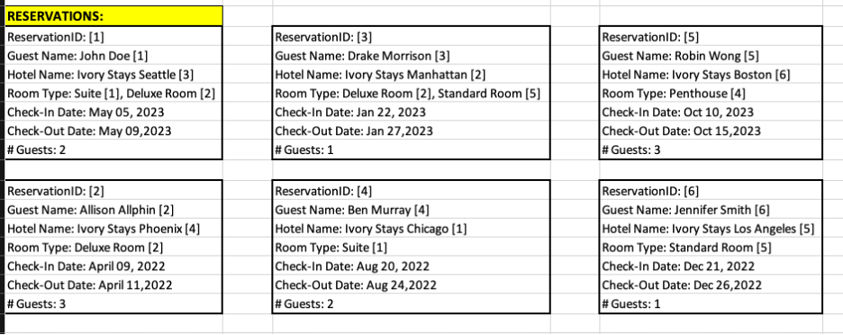
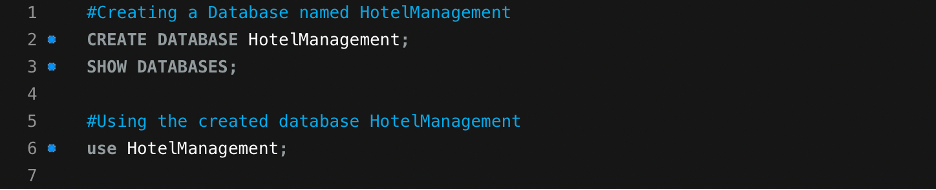
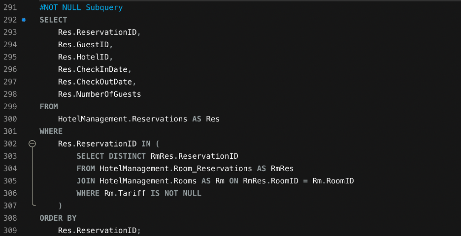

# Hotel-Management-System

**Introduction**

Ivory Stays represents an emerging chain of luxury hotels, each offering unparalleled guest experiences across United States. The project proposes the development of a Hotel Management System (HMS) to streamline operations, enhance guest satisfaction, and optimize resource allocation across all Ivory Stays properties.

**Objective** The objective of this HMS is to automate the hotel management including reservations, guest services, room assignments and billing process in the future.

**Dataset Overview** The dataset for Ivory Stays is structured around several key entities:

Guest - Represents a person who books a room. (Information on hotel guests, including personal details, preferences, and stay history)

Hotel - Represents the hotel where rooms are booked. (Details of Ivory Stays property, location, facilities, and tariff)

Room Type - Represents different types of rooms available in a hotel. (Specifications of the various room types, features)

Reservation - Represents a booking made by a guest for a room at a specific hotel. (Detailed records of bookings, including dates, rooms, and number of guests)

Initial Dataset created for Hotel Management system:

*Data1*\

*Data2*\

*Defining the relationships*

Guest to Reservation: One-to-Many (One guest can make multiple reservations) Hotel to Room Type: One-to-Many (One hotel can offer multiple room types) \
Reservation to Room Type: Many-to-One (Each reservation is for one type of room) \
Reservation to Hotel: Many-to-One (Each reservation is associated with one hotel) \
\
The below Conceptual Model is created based on the initial data for Hotel Management System.

*Conceptual Model*\

Developing the Logical Model using junction entity to resolve many-to-many relationship:\
\
*Logical Model*

*Physical Model*\

Creating a Database named HotelManagement:

Creating Tables in the HotelManagement Database:

Inserting records in the Tables created in HotelManagement Database:

Displaying Data from Guests Table ordered by GuestID:

Displaying Data from Hotels Table ordered by HotelID:

Displaying Data from Rooms Table ordered by RoomID:

Displaying Data from Reservations Table ordered by ReservationID:

Displaying Data from Room_Reservations Table ordered by RoomID, ReservationID:

A SQL involving the junction table and two other related tables. Using the INNER JOIN to connect with all three tables.

*Query*

*Results*

The results provides insights into which rooms were booked in each reservation, supporting analysis of customer preferences, pricing trends, and room utilization.

A SQL by including two or more tables and using the LEFT OUTER JOIN. Displaying and sorting the results by key field(s).

*Query*

\
*Results*

LEFT OUTER JOIN vs. INNER JOIN: LEFT OUTER JOIN includes all reservations regardless of whether there is a matching guest or room. INNER JOIN would only return reservations where a guest and room are present for each reservation.

A single-row subquery. Displaying and sorting the results by key field(s).

*Query*

*Results*

The result shows reservation details for those that have the highest number of guests. As multiple reservations have the same maximum value, all of them are included in the results.

A multiple-row subquery. Displaying and sorting the results by key field(s).

*Query*

*Results*

This query returns all reservations made by guests who live on streets containing "Maple" in their address. Multiple-row subqueries are useful for filtering data based on relationships across tables.

A SQL to aggregate the results by using multiple columns in the SELECT clause.

*Query*

*Results*

This result shows each hotel, its total reservations, total guests, and average guests per reservation.

A subquery using the NOT IN operator. Displaying and sorting the results by key field(s).

*Query*

*Results*

This query returns a list of guests who have registered in the system but haven't booked any reservations. Each row contains information such as the guest's name, contact number, and address.

A query using a CASE statement. Displaying and sorting the results by key field(s).

*Query*

*Results*

This query results classify guests into one of the four categories (No Reservations, New Guest, Returning Guest, Frequent Guest), providing additional data such as the number of reservations each guest has made.

\
A query using the NOT EXISTS operator. Displaying and sorting the results by key field(s).

*Query*

*Results*

This output shows all guests who are registered in the Guests table but don't have any reservations. Each row includes details like the guest's name, contact, and address.

A subquery using the NOT NULL operator in the inner query. Displaying and sorting the results by key field(s).

*Query*

*Results*

This query results lists all reservations that are linked to rooms with non-null tariffs. Each row will contain reservation details like guest ID, hotel ID, and booking dates.

**SUMMARY**

The proposed Hotel Management System (HMS) for Ivory Stays is designed to streamline operations, enhance guest satisfaction, and optimize resource allocation across the hotel chain. By collecting data from key entities like guests, reservations, rooms, and hotels, the HMS will automate the booking process, facilitate accurate room assignments, and customize guest services. Utilizing a SQL database ensures that structured data are efficiently stored and managed, providing a comprehensive solution for all hotel management needs.

This HMS will not only improve operational efficiency but also leverage data analytics to deliver personalized guest experiences, optimize resource allocation, and enhance strategic planning. A secure, scalable architecture, compliant with data protection regulations, ensures reliability and resilience as the hotel chain expands. The system's real-time analytics and reporting features will empower management with actionable insights, ultimately resulting in higher guest satisfaction and increased profitability for Ivory Stays.
